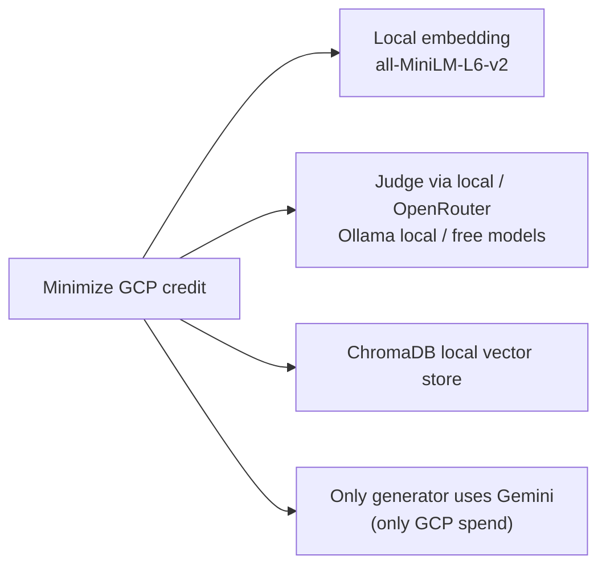
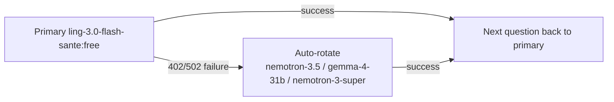

# DECISIONS.md — Insurance Knowledge Assistant

Technical design and engineering decisions: what was chosen, why, and what trade-offs were made.

---

## A. Foundation

| # | Decision | Choice | Alternatives | Rationale |
|---|----------|--------|--------------|-----------|
| D1 | Backend framework | FastAPI | Flask / Django | Standard for AI apps; async; auto OpenAPI docs |
| D2 | Generator LLM | Gemini 2.5 Flash (Vertex AI) | GPT-4o-mini | GCP/Liberty fit; cheap and fast |
| D3 | Embedding provider | Local all-MiniLM-L6-v2 (384d) | Vertex AI Embeddings | Avoid GCP credit; 384d sufficient for semantic search |
| D4 | Vector store | ChromaDB (local) | Pinecone / Qdrant | Free, no ops; hosted is paid; scales for this corpus |
| D5 | Retrieval | Dense-only | Hybrid (dense + BM25) | Dense hit 10/10 now; BM25 pending (see B) |
| D6 | Structured output | Pydantic (API) | Instructor | Already used by backend; no extra dependency |

### Why "local-first" to keep GCP cost near zero

```mermaid
flowchart LR
    COST["Minimize GCP credit"] --> E["Local embedding<br/>all-MiniLM-L6-v2"]
    COST --> J["Judge via local / OpenRouter<br/>Ollama local / free models"]
    COST --> V["ChromaDB local vector store"]
    COST --> G["Only generator uses Gemini<br/>(only GCP spend)"]
```

---

## B. Retrieval

| # | Decision | Choice | Alternatives | Rationale |
|---|----------|--------|--------------|-----------|
| B1 | Retrieval method | Dense embedding search | Hybrid (dense + BM25) | Insurance terms; dense already 10/10; BM25 pending |
| B2 | Retrieval params | top_k=5, threshold=0.4, chunk=512/50 | Others | Initial values; tunable via experiments |
| B3 | Rerank | Not implemented yet | Cross-encoder BGE-Reranker | Pending; see next-step analysis |
| B4 | Context injection | core_top1 (top1 only) | full top_k | "Minimal-context baseline"; optional `--ctx-mode full` |

---

## C. Evaluation

| # | Decision | Choice | Alternatives | Rationale |
|---|----------|--------|--------------|-----------|
| C1 | Eval framework | RAGAS 0.4.3 | DeepEval / custom | Mature; standard faithfulness |
| C2 | Metric families | Low-cost + RAGAS dual-track | Single family | Low-cost for fast regression; RAGAS for semantic depth |
| C3 | Low-cost metrics | hit_rate/MRR/precision@k/recall@k + ROUGE/BERTScore | — | No LLM, sub-second, CI-friendly |
| C4 | RAGAS metrics | faithfulness / answer_relevancy / context_recall / context_precision / answer_correctness | — | Covers 4 failure layers (retrieval + generation) |
| C5 | Judge backend | Ollama local + OpenRouter free | GCP Gemini | Avoid credit; local gemma / free cloud |
| C6 | Judge policy | Fixed primary + auto-rotate on failure | Fixed only | Primary ling-3.0-flash-sante; rotate to nemotron/gemma |
| C7 | Resumability | Per-question progress JSON | One-shot | Long jobs (13h local) resume across restarts |
| C8 | Result tracking | MLflow (SQLite local) | Cloud MLflow | Free; sufficient for single machine |
| C9 | Context metric mode | context_recall with top1 | full top_k | Baseline; compare mode available later |
| C10 | Eval harness metrics | Pure orchestration (no new metrics) | Add new metrics | Simplicity first; unify before extending |

### Why "pluggable + auto-rotate" judge

```mermaid
flowchart LR
    P["Primary ling-3.0-flash-sante:free"] -->|"402/502 failure"| R["Auto-rotate<br/>nemotron-3.5 / gemma-4-31b / nemotron-3-super"]
    P -->|"success"| N["Next question back to primary"]
    R -->|"success"| N
```

---

## D. Operational Failures & Mitigations

| # | Wall hit | Symptom | Fix |
|---|----------|---------|-----|
| D-fail-1 | RAGAS 0.4.3 dependency | Required downgraded langchain stack | Pinned langchain 0.3.x |
| D-fail-2 | gemma4:12b faithfulness | Long JSON truncated on CPU -> endless loop | Switched to gemma3:4b / cloud |
| D-fail-3 | openrouter/free random routing | Safety rejection / 1gen vs 3gen | Fixed model (ling-3.0-flash-sante:free) |
| D-fail-4 | Free endpoint quota | 402 Insufficient balance / 502 | Auto-rotate to other free models |
| D-fail-5 | AnswerSimilarity unset | "AnswerSimilarity must be set" | Explicitly inject judge_emb |
| D-fail-6 | Local 13.5h wall-clock | 40-80 min per question | Cloud free models ~190x faster |

---

## E. Next Decisions

| # | Decision | Direction | Status |
|---|----------|-----------|--------|
| E1 | Hybrid retrieval (BM25 + dense) | Add | **Implemented** |
| E2 | Reranker (cross-encoder) | Add | To evaluate |
| E3 | Citation grounding | Improve | To evaluate |
| E4 | Eval harness orchestrator | Add (pure orchestration/reuse) | **Confirmed, pending** |
| E5 | Report language | English only | **Confirmed** |
| E6 | Deploy Docker + Cloud Run | Phase 4 | Pending |
| E7 | CI regression gate | Phase 4 | Deferred |

### F. Phase 4 Integrations

| # | Decision | Choice | Rationale |
|---|----------|--------|-----------|
| E8 | DeepEval integration | Add alongside RAGAS | Agent/tool-call eval beyond RAGAS; completes eval coverage |
| E9 | PII masking + prompt-injection defense | Add | Insurance compliance (customer PII); enterprise security requirement |
| E10 | pytest + CI regression gate | Add | Engineering gap fix; prevents eval regressions |
| E11 | Prometheus monitoring + cost tracking | Add | Production observability; latency + token cost already partially tracked in harness |
| E12 | Expand gold dataset to ~50 QA | **Done** (52 Q, 2026-09-04) | Current 10 Q insufficient; 50+ completed |

E1-E3 detailed in gap-analysis report. E1-E3 main line continues as-is; E8-E12 to be integrated at Phase 4.

### P1 Hybrid Retrieval — Empirical Result (2026-09-04)

| Finding | Result |
|---------|--------|
| Retrieval-level difference | Hybrid genuinely changes top-5 content (overlap 3-5/5); recovers docs dense drops at threshold (q8) |
| Top-1 context | Identical in 8/10 questions |
| RAGAS context_recall / context_precision | Unchanged: 0.75 / 0.90 |
| RAGAS faithfulness / answer_relevancy | 0.699->0.756 / 0.847->0.911, but **NOT attributable to hybrid** (dense vs hybrid answers generated on different days; LLM non-determinism confounds) |
| RAGAS answer_correctness | 0.870->0.747 (10/10 scored); not cleanly attributable either |

> Conclusion: On this tiny 26-chunk corpus, dense already saturates top-1 relevance, so hybrid does not move RAGAS context metrics. The generation-metric deltas are confounded and must not be claimed as hybrid improvements. Hybrid's value is best demonstrated on a larger, term-heavy corpus (defer to later). Roadmap-verified item E1 closed.

### P2 Cross-Encoder Reranker — Result (2026-09-04)

| Item | Detail |
|------|--------|
| Model | `cross-encoder/ms-marco-MiniLM-L-6-v2` (CPU-friendly, ~90MB) |
| Integration | `src/rag/reranker.py` + `VectorStore.search_hybrid(rerank, reranker_top_k)`; wired API + both eval scripts |
| Default | `rerank: false` (backwards compatible; P1 behavior unchanged) |
| Tests | `tests/test_reranker.py` (4) + suite = 11/11 pass |
| Empirical (this corpus) | rerank changes top-1 for **1/10** (q9: corrects a malformed BM25 chunk to the right "cyber liability" chunk) |

> Decision: reranker is implemented as an opt-in stage. Like P1, the saturated tiny corpus limits demonstrable change. Value expected on a larger, noisier corpus — conclusive RAGAS comparison deferred until corpus is expanded. Roadmap-verified item closed.

### Data & Gold Dataset Expansion — Result (2026-09-04)

| Item | Before | After |
|------|--------|-------|
| Documents | 5 | 15 (10 new: renters, umbrella, commercial auto, E&O, workers comp, commercial property, annuities, disability, flood, travel) |
| Corpus chunks | 26 | 74 |
| Benchmark QA | 10 | 52 |
| Retrieval top1 (dense->hybrid) | saturated 1.00/1.00 | **0.942 -> 0.981** (+0.039) |
| Retrieval MRR (dense->hybrid) | saturated 1.00/1.00 | **0.962 -> 0.990** (+0.028) |
| Hybrid fixed / regressed | 0/0 | **2 fixed, 0 regressed** (q27 slip-and-fall->business_liability, q32 E&O->professional_liability) |

> Deliberately added confusable insurance families (liability family, income-replacement, property exclusions) so dense embeddings are no longer trivially separable. Non-saturated retrieval now honestly demonstrates hybrid's value. Rerank recovers BM25 precision@5 loss (0.665->0.692) but stays neutral on top-1. Corpus rebuild is reproducible via `scripts/seed_corpus.py`. E12 closed.

### S1 Shared Keyed Sample-Artifact — Result (2026-09-05)

| Item | Detail |
|------|--------|
| Problem | Two eval tracks generated Gemini answers separately (2x cost, inconsistent scores); `ragas_samples.json` was reused blindly -> stale-cache bug (would have silently scored only 10 of 52) |
| Fix | `src/evaluation/sample_artifact.py`: one artifact per key (benchmark digest + corpus digest + retrieval config + generator); `load_samples` validates count + fields; atomic `save_samples` |
| Wiring | `run_evaluation.py` generates on cache miss + persists; `run_ragas_evaluation.py` reuses artifact with zero re-generation/re-retrieval; progress files now keyed by artifact digest too |
| Consistency | both tracks score the SAME user_input/response; retrieved_contexts = core top-1 (unchanged `core_top1` mode) |
| Honesty | warm-run `avg_generation_s` -> `nan` (latency NOT measured, not faked); `samples_reused` logged to MLflow |
| Tests | `tests/test_sample_artifact.py` (12) + suite = 23/23 pass |
| Smoke | 2-Q cold run generated+persisted; warm rerun `questions_generated: 0` with identical rouge/bert; RAGAS `_prepare_samples` reused=True on same key |
| Artifacts | `samples_*.json` + progress now gitignored (regenerable); stale 10-Q `ragas_samples.json` moved to `tmp/stale_pre_s1/` |

> Decision: generation is now a preparation step decoupled from scoring. This hardens eval methodology (S1 of the production-readiness roadmap) and unblocks the 52-Q RAGAS 3-way comparison (dense/hybrid/rerank) with zero re-generation. E13 opened -> will be closed by the 52-Q RAGAS run.
