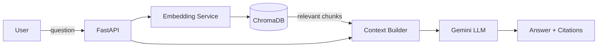
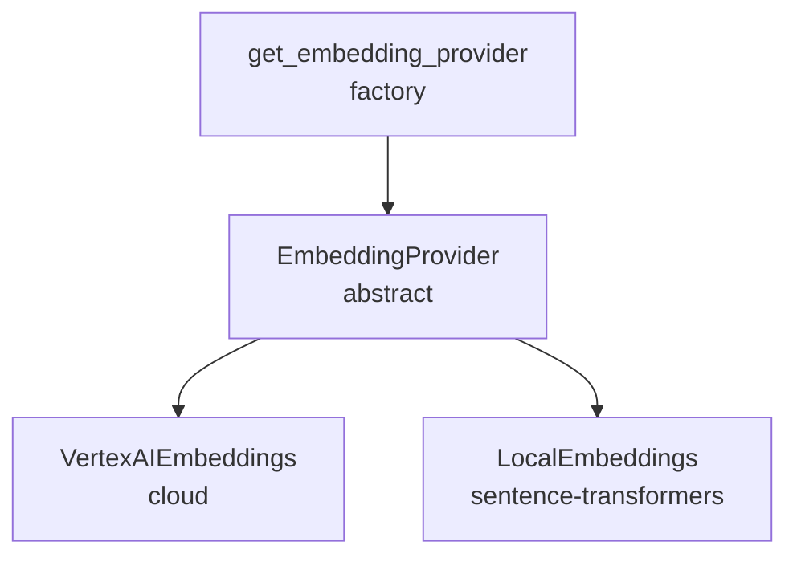
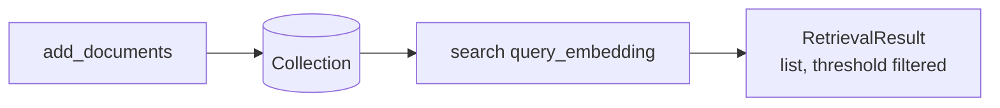
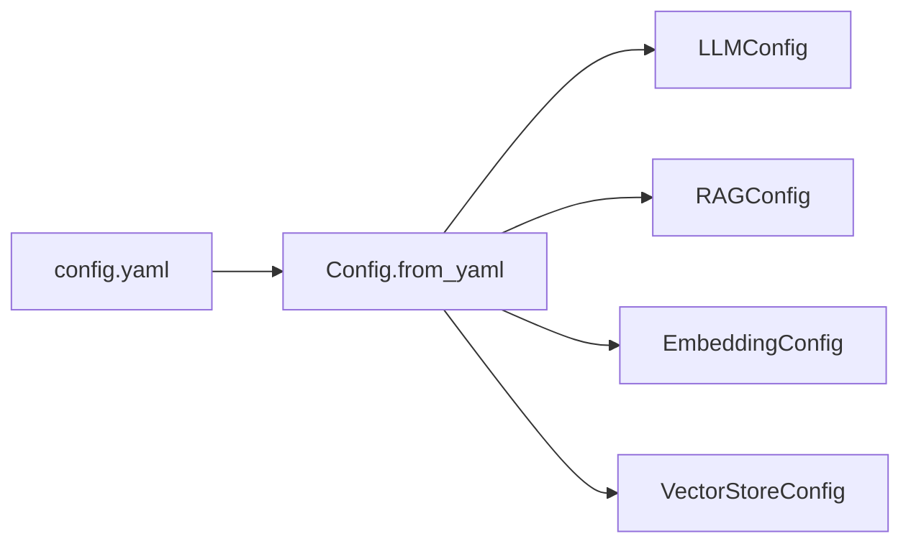

# Architecture

This document describes the system architecture of the Insurance Knowledge Assistant.

## System Overview

The system is a RAG (Retrieval-Augmented Generation) application that enables employees to ask natural-language questions about insurance knowledge and receive answers grounded in the organization's documents.

### High-Level Flow

## Components

### 1. API Layer (`src/api/main.py`)

FastAPI application exposing REST endpoints:

| Endpoint | Method | Description |
|----------|--------|-------------|
| `/` | GET | Service info |
| `/health` | GET | Health check + doc count |
| `/ingest` | POST | Load & store a document |
| `/query` | POST | Ask a question (RAG) |

### 2. Ingestion (`src/rag/ingestion.py`)

- Loads documents (TXT/PDF)
- Splits into chunks (`chunk_size=512`, `overlap=50`)
- Decouples loading from storage for testability

### 3. Embedding (`src/rag/embedding.py`)

Abstract `EmbeddingProvider` interface with two implementations:

- **VertexAI**: `text-embedding-004` (768-dim)
- **Local**: `all-MiniLM-L6-v2` (384-dim)

### 4. Retrieval (`src/rag/retrieval.py`)

ChromaDB persistent vector store with cosine similarity search:

### 5. Generation (`src/rag/generation.py`)

Uses Vertex AI Gemini with a system prompt instructing grounded, cited answers.

## Configuration

Configuration is centralized in `configs/config.yaml`, loaded via type-safe dataclasses:

## Design Decisions

| Decision | Rationale |
|----------|-----------|
| Pluggable embedding layer | Swap cloud/local without changing pipeline |
| Abstract provider interfaces | Enables unit testing with mocks |
| Persistent ChromaDB | Local, free, no external service dependency |
| Centralized YAML config | Single source of truth, environment-agnostic |
| Type-safe config (dataclasses) | Compile-time validation via pydantic-style defaults |

## Future Extensions

- **Evaluation module**: retrieval metrics (recall@k, MRR), answer accuracy, latency
- **MLOps**: experiment tracking with MLflow, monitoring, logging
- **Deployment**: containerize (Docker) and deploy to Cloud Run
- **Air-Gapped**: support local LLM fallback (Ollama) for offline demo
